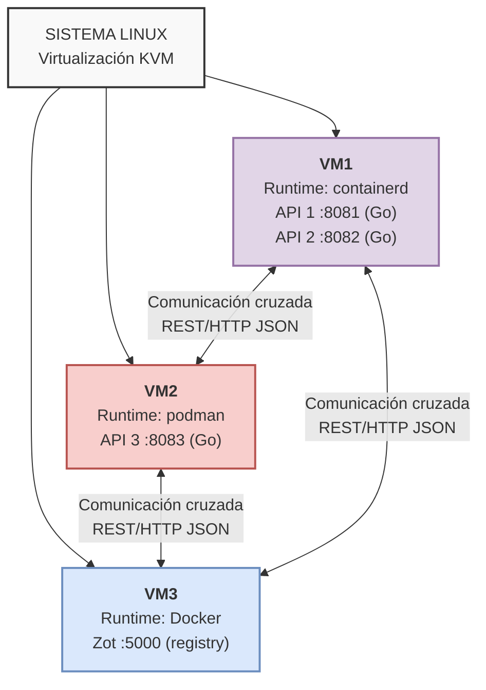

# Manual Técnico — Proyecto 1
## Desarrollo, Conexión y Gestión de Contenedores en Entornos Virtualizados

**Sistemas Operativos 1 — Universidad de San Carlos de Guatemala**
**Facultad de Ingeniería — Ingeniería en Ciencias y Sistemas**
**Estudiante:** Sergio Jair Recinos Recinos 
**Carnet:** 202207999

---

## Arquitectura general

El proyecto simula un entorno de microservicios distribuido en 3 máquinas virtuales, cada una con un runtime de contenedores distinto, comunicadas entre sí mediante APIs REST y un registro privado de imágenes.

| VM | IP | Runtime | Qué corre |
|---|---|---|---|
| VM1 | 192.168.122.220 | Containerd (nerdctl) | API1 (Go), API2 (Go) |
| VM2 | 192.168.122.156 | Podman | API3 (Go) |
| VM3 | 192.168.122.202 | Docker | Zot (registro de imágenes) |



---

## Preparación del entorno

### VM1 — Instalación de Containerd + nerdctl

```bash
sudo apt update && sudo apt upgrade -y
sudo apt install -y containerd
sudo systemctl enable --now containerd

CTD_VERSION="2.0.5"
wget https://github.com/containerd/nerdctl/releases/download/v${CTD_VERSION}/nerdctl-full-${CTD_VERSION}-linux-amd64.tar.gz
sudo tar Cxzvvf /usr/local nerdctl-full-${CTD_VERSION}-linux-amd64.tar.gz
sudo systemctl enable --now buildkit
```

**Verificación:**
```bash
nerdctl --version
sudo nerdctl run --rm hello-world
```
Resultado: `nerdctl version 2.0.5` — contenedor `hello-world` ejecutado correctamente.

### VM2 — Instalación de Podman

```bash
sudo apt update && sudo apt upgrade -y
sudo apt install -y podman
```

**Verificación:**
```bash
podman --version
podman run --rm hello-world
```
Resultado: `podman version 3.4.4` — contenedor `hello-world` ejecutado correctamente.

### VM3 — Instalación de Docker

```bash
sudo apt update && sudo apt upgrade -y
sudo apt install -y ca-certificates curl gnupg
sudo install -m 0755 -d /etc/apt/keyrings
curl -fsSL https://download.docker.com/linux/ubuntu/gpg | sudo gpg --dearmor -o /etc/apt/keyrings/docker.gpg
sudo chmod a+r /etc/apt/keyrings/docker.gpg

echo \
  "deb [arch=$(dpkg --print-architecture) signed-by=/etc/apt/keyrings/docker.gpg] https://download.docker.com/linux/ubuntu \
  $(. /etc/os-release && echo "$VERSION_CODENAME") stable" | \
  sudo tee /etc/apt/sources.list.d/docker.list > /dev/null

sudo apt update
sudo apt install -y docker-ce docker-ce-cli containerd.io docker-buildx-plugin docker-compose-plugin
sudo usermod -aG docker $USER
```

**Verificación:**
```bash
docker --version
docker run --rm hello-world
```
Resultado: `Docker version 29.7.2` — contenedor `hello-world` ejecutado correctamente.

---

## Desarrollo de las APIs en Go

### Diseño

Se implementó un único binario en Go, parametrizable por variables de entorno, que se comporta como API1, API2 o API3 según su configuración. Esto permite reutilizar el mismo código fuente para las 3 APIs, ejecutándolas como servicios independientes en contenedores distintos.

**Variables de entorno usadas:**

| Variable | Descripción | Ejemplo |
|---|---|---|
| `APINAME` | Nombre de la API | `API1` |
| `APINUM` | Número de la API (para la ruta) | `1` |
| `VM` | Nombre de la VM donde corre | `VM1` |
| `CARNET` | Carnet del estudiante | `202207999` |
| `PORT` | Puerto donde escucha | `8081` |
| `PEERS` | Mapeo de APIs vecinas (formato `API#=VM#\|URL`) | `API2=VM1\|http://192.168.122.220:8082,API3=VM2\|http://192.168.122.156:8083` |

> **Nota de diseño:** el formato de `PEERS` incluye el nombre de la VM de cada vecino además de su URL. Esto es necesario para que el mensaje de error (`"ERROR: The API# located on the VM# is not working"`) pueda indicar la VM del peer caído, incluso cuando la conexión falla y no hay forma de obtener esa VM desde una respuesta real.

### Endpoints implementados

- `GET /health` → estado de la propia API
- `GET /api{N}/{carnet}/call-api{M}` → consulta el `/health` de la API vecina M y reporta si está operativa

### Estructura de respuestas

**`/health`:**
```json
{
  "status": "UP",
  "message": "API1 is Ready",
  "timestamp": "2026-08-17T23:06:53Z",
  "VM": "VM1",
  "carnet": "202207999"
}
```

**`/api{N}/{carnet}/call-api{M}` (éxito):**
```json
{
  "apiname": "API3",
  "message": "The API3 located on the VM2 is working",
  "connection": true,
  "carnet": "202207999"
}
```

**`/api{N}/{carnet}/call-api{M}` (error, peer caído):**
```json
{
  "apiname": "API2",
  "message": "ERROR: The API2 located on the VM1 is not working",
  "connection": false,
  "carnet": "202207999"
}
```

### Código fuente

- `main.go` — lógica de las APIs (handlers `/health` y `/call-apiN`)
- `go.mod` — módulo Go, sin dependencias externas (solo librería estándar)
- `Dockerfile` — build multi-stage (compila con `golang:1.22-alpine`, imagen final en `alpine:latest`)

*(Ver archivos anexos en el repositorio: `main.go`, `go.mod`, `Dockerfile`)*

---

## Construcción y despliegue de contenedores

### Copia de archivos a VM1 y VM2

```bash
scp main.go go.mod Dockerfile jair@192.168.122.220:~/api-service/
scp main.go go.mod Dockerfile jair@192.168.122.156:~/api-service/
```

### VM1 — Build y despliegue de API1 y API2 (containerd/nerdctl)

```bash
cd ~/api-service
sudo nerdctl build -t api-202207999:latest .

sudo nerdctl tag api-202207999:latest api1-202207999:latest
sudo nerdctl tag api-202207999:latest api2-202207999:latest

sudo nerdctl run -d --name api1 --restart unless-stopped -p 8081:8081 \
  -e APINAME=API1 -e APINUM=1 -e VM=VM1 -e CARNET=202207999 -e PORT=8081 \
  -e PEERS="API2=VM1|http://192.168.122.220:8082,API3=VM2|http://192.168.122.156:8083" \
  api1-202207999:latest

sudo nerdctl run -d --name api2 --restart unless-stopped -p 8082:8082 \
  -e APINAME=API2 -e APINUM=2 -e VM=VM1 -e CARNET=202207999 -e PORT=8082 \
  -e PEERS="API1=VM1|http://192.168.122.220:8081,API3=VM2|http://192.168.122.156:8083" \
  api2-202207999:latest
```

**Verificación:**
```bash
sudo nerdctl ps
curl http://localhost:8081/health
curl http://localhost:8082/health
```
Resultado: ambas APIs responden `"status":"UP"`.

### VM2 — Ajuste de Podman y despliegue de API3

Podman requirió configurar el registro por defecto para poder resolver nombres cortos de imagen (`golang:1.22-alpine`):

```bash
sudo tee -a /etc/containers/registries.conf > /dev/null << 'EOF'

unqualified-search-registries = ["docker.io"]
EOF
```

Build y despliegue:
```bash
cd ~/api-service
podman build -t api3-202207999:latest .

podman run -d --name api3 --restart unless-stopped -p 8083:8083 \
  -e APINAME=API3 -e APINUM=3 -e VM=VM2 -e CARNET=202207999 -e PORT=8083 \
  -e PEERS="API1=VM1|http://192.168.122.220:8081,API2=VM1|http://192.168.122.220:8082" \
  localhost/api3-202207999:latest
```

> **Nota:** Podman etiqueta las imágenes locales con el prefijo `localhost/`, por lo que ese prefijo debe usarse al correr el contenedor.

**Verificación:**
```bash
podman ps
curl http://localhost:8083/health
```
Resultado: `{"status":"UP","message":"API3 is Ready","VM":"VM2","carnet":"202207999"}`

### Prueba de comunicación cruzada entre VMs

```bash
curl http://192.168.122.220:8081/api1/202207999/call-api2
curl http://192.168.122.220:8081/api1/202207999/call-api3
curl http://192.168.122.220:8082/api2/202207999/call-api1
curl http://192.168.122.220:8082/api2/202207999/call-api3
curl http://192.168.122.156:8083/api3/202207999/call-api1
curl http://192.168.122.156:8083/api3/202207999/call-api2
```
Las llamadas devuelven `"connection": true` con el mensaje `"The API# located on the VM# is working"`, confirmando comunicación REST cruzada entre VMs distintas con el formato exacto del enunciado.

---

## Registro privado de imágenes con Zot

### Instalación y configuración en VM3

```bash
mkdir -p ~/zot/config ~/zot/data
cd ~/zot
```

`config/config.json`:
```json
{
  "distSpecVersion": "1.1.0",
  "storage": {
    "rootDirectory": "/var/lib/registry"
  },
  "http": {
    "address": "0.0.0.0",
    "port": "5000"
  },
  "log": {
    "level": "info"
  }
}
```

Despliegue:
```bash
docker run -d --name zot \
  -p 5000:5000 \
  -v ~/zot/data:/var/lib/registry \
  -v ~/zot/config/config.json:/etc/zot/config.json \
  ghcr.io/project-zot/zot-linux-amd64:latest

docker update --restart unless-stopped zot
```

**Verificación:**
```bash
curl http://localhost:5000/v2/
```
Resultado: `{}` — registro activo y respondiendo al protocolo Docker Registry v2.

### Habilitar registro inseguro (HTTP) en los clientes

Como Zot corre sobre HTTP plano (sin TLS), fue necesario indicarle a cada motor de contenedores que confiara explícitamente en esa IP.

**VM1 (containerd):** `/etc/containerd/certs.d/192.168.122.202:5000/hosts.toml`
```toml
server = "http://192.168.122.202:5000"

[host."http://192.168.122.202:5000"]
  capabilities = ["pull", "resolve", "push"]
```
```bash
sudo systemctl restart containerd
```

**VM2 (podman):** agregado a `/etc/containers/registries.conf`
```toml
[[registry]]
location = "192.168.122.202:5000"
insecure = true
```

---

## Push / Pull de imágenes al registro

### Problema encontrado: `nerdctl push` incompatible con Zot

```
FATA[0000] failed commit on ref "manifest-sha256:...": unexpected status
from PUT request to http://192.168.122.202:5000/v2/api1-202207999/manifests/latest:
415 Unsupported Media Type
```

**Causa:** incompatibilidad de formato de manifest entre `nerdctl`/`containerd` y la implementación de Zot.

**Solución:** exportar la imagen a un archivo `.tar` y subirla usando **skopeo**.

```bash
sudo apt install -y skopeo

sudo nerdctl save -o api1.tar api1-202207999:latest
sudo nerdctl save -o api2.tar api2-202207999:latest

sudo skopeo copy docker-archive:api1.tar docker://192.168.122.202:5000/api1-202207999:latest --dest-tls-verify=false
sudo skopeo copy docker-archive:api2.tar docker://192.168.122.202:5000/api2-202207999:latest --dest-tls-verify=false
```

### Push desde VM2 (Podman funcionó sin problemas)

```bash
podman tag localhost/api3-202207999:latest 192.168.122.202:5000/api3-202207999:latest
podman push 192.168.122.202:5000/api3-202207999:latest
```

### Verificación del contenido del registro

```bash
curl http://192.168.122.202:5000/v2/_catalog
```
Resultado: `{"repositories":["api1-202207999","api2-202207999","api3-202207999"]}`

```bash
curl http://192.168.122.202:5000/v2/api1-202207999/tags/list
curl http://192.168.122.202:5000/v2/api2-202207999/tags/list
curl http://192.168.122.202:5000/v2/api3-202207999/tags/list
```
Resultado: cada uno devuelve `{"name":"api#-202207999","tags":["latest"]}`.

### Verificación de pull (descarga desde el registro)

Para confirmar el flujo completo bidireccional, se descargó una copia de `api1-202207999` directamente desde el registro Zot, sin depender de la imagen local:

```bash
sudo skopeo copy \
  docker://192.168.122.202:5000/api1-202207999:latest \
  docker-archive:/tmp/api1-pull-test.tar \
  --src-tls-verify=false

sudo nerdctl load -i /tmp/api1-pull-test.tar
sudo nerdctl images | grep api1
```

Resultado: archivo `.tar` de 16 MB descargado exitosamente desde el registro, cargado como imagen local mediante `nerdctl load`, y visible junto a la imagen original en `nerdctl images`. Esto confirma que el registro privado funciona correctamente tanto para subida como para descarga de imágenes.

---

## Incidentes de estabilidad y sus soluciones

Esta sección documenta problemas reales encontrados durante las pruebas, como evidencia de resolución autónoma de problemas.

### Zot no sobrevivió el primer reinicio de VM3

**Síntoma:** tras reiniciar VM1, una prueba de conexión a Zot devolvió `no route to host`.

**Diagnóstico:**
```bash
ssh jair@192.168.122.202
docker ps -a | grep zot
# Exited (0) 9 minutes ago
```

**Causa:** el contenedor `zot` se creó sin política de reinicio automático.

**Solución:**
```bash
docker start zot
docker update --restart unless-stopped zot
```
Docker respeta esta política incluso tras reinicios completos del host, así que este caso quedó resuelto de forma permanente.

### `api1`, `api2` y `api3` tampoco sobrevivieron el reinicio de sus VMs

**Síntoma:** al reiniciar VM1 y VM2, los contenedores de las APIs no volvieron a estar disponibles:
- En VM1, `nerdctl ps -a` mostraba `api1` y `api2` en estado `Created` (nunca llegaron a iniciar el proceso).
- En VM2, `podman ps -a` mostraba `api3` en `Exited (2)`.

**Diagnóstico clave:** `podman logs api3` mostró que la API había arrancado bien antes del apagado (`API3 iniciando en puerto 8083...`), sin ningún error de aplicación — el problema era puramente de orquestación del sistema, no del código.

**Causa raíz:** a diferencia de Docker, containerd/nerdctl y Podman rootless no relanzan contenedores automáticamente tras un reinicio completo del sistema operativo, incluso con la bandera `--restart unless-stopped`. Esa bandera solo cubre el caso de que el proceso del contenedor muera mientras el sistema sigue encendido; no cubre el reboot completo del host.

**Solución aplicada (dos capas de protección):**

1. Se agregó `--restart unless-stopped` a la creación de los 3 contenedores (cobertura para crashes en caliente).
2. Se agregó un respaldo con cron `@reboot`, que sí se ejecuta de forma confiable al arrancar el sistema:

En VM1 (`sudo crontab -e`):
```
@reboot sleep 20 && /usr/local/bin/nerdctl start api1 api2
```

En VM2, además se habilitó *linger* para que el systemd de usuario (donde vive Podman rootless) siga activo sin sesión iniciada:
```bash
sudo loginctl enable-linger jair
```
Y en `crontab -e` (de usuario, sin sudo):
```
@reboot sleep 20 && podman start api3
```

**Resultado:** tras aplicar esto, un reinicio completo de las 3 VMs recuperó `api1`, `api2` y `api3` automáticamente, sin intervención manual, confirmado en una prueba posterior.

### Formato de mensaje de error no coincidía con el enunciado

**Síntoma:** el mensaje de error de `call-apiN` no incluía el nombre de la VM del peer caído.

- Se generaba: `"ERROR: The API2 is not working"`
- El enunciado pide: `"ERROR: The API2 located on the VM1 is not working"`

**Causa:** el código original solo guardaba la URL de cada peer, no su nombre de VM, así que en caso de fallo de conexión no había forma de reportar esa VM.

**Solución:** se extendió el formato de la variable `PEERS` para incluir la VM de cada peer (`API#=VM#|URL` en vez de solo `API#=URL`), y se actualizó el código para usar ese dato tanto en el mensaje de éxito como en el de error.

---

## Reflexión y habilidades blandas

El desarrollo de este proyecto presentó varios problemas no anticipados en el enunciado original, que requirieron investigación y resolución autónoma antes de poder avanzar:

- Incompatibilidad de formato de manifest entre `nerdctl push` y Zot, resuelta usando `skopeo` como herramienta intermedia tras identificar la causa exacta del error `415 Unsupported Media Type`.
- Descubrimiento de que ni containerd/nerdctl ni Podman rootless reinician contenedores automáticamente tras un reboot completo del sistema operativo, a diferencia de Docker. Esto exigió diseñar una solución de dos capas (`--restart unless-stopped` más `cron @reboot`) y entender la diferencia entre persistencia de proceso y persistencia de sistema.
- Ajuste del diseño de la aplicación (formato de la variable `PEERS`) para que los mensajes de error cumplieran exactamente con el formato JSON especificado en el enunciado, incluso en el caso donde la información necesaria (la VM del peer) no puede obtenerse de una conexión fallida.

Cada uno de estos incidentes se diagnosticó revisando logs y salidas de los propios runtimes (`docker logs`, `podman logs`, `nerdctl ps -a`), en vez de asumir causas, lo cual permitió aplicar soluciones dirigidas al problema real en cada caso.

---
Proyecto 1 — Sistemas Operativos 1, USAC.*