# Proyecto 1 — Desarrollo, Conexión y Gestión de Contenedores en Entornos Virtualizados

**Sistemas Operativos 1 — Universidad de San Carlos de Guatemala**
**Facultad de Ingeniería — Ingeniería en Ciencias y Sistemas**

| | |
|---|---|
| **Estudiante** | Sergio Jair Recinos Recinos |
| **Carnet** | 202207999 |
| **Repositorio** | [202207999_LAB_SO1_2S2026](https://github.com/SergioJR2/202207999_LAB_SO1_2S2026) |

---

## Descripción

Entorno virtualizado de microservicios que integra máquinas virtuales (KVM) y 3 runtimes de contenedores distintos (Containerd, Podman, Docker), con APIs REST desarrolladas en Go que se comunican entre sí, y un registro privado de imágenes (Zot) para su distribución.

## Arquitectura

| VM | IP | Runtime | Qué corre |
|---|---|---|---|
| VM1 | 192.168.122.220 | Containerd (nerdctl) | API1 (Go) :8081, API2 (Go) :8082 |
| VM2 | 192.168.122.156 | Podman | API3 (Go) :8083 |
| VM3 | 192.168.122.202 | Docker | Zot :5000 (registro de imágenes) |

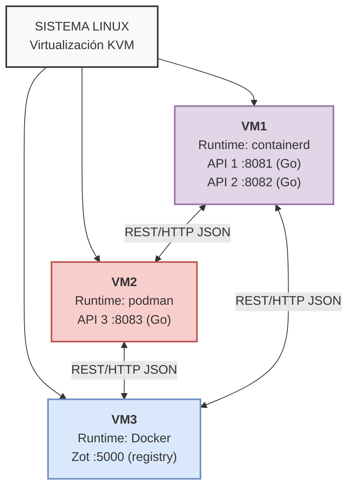

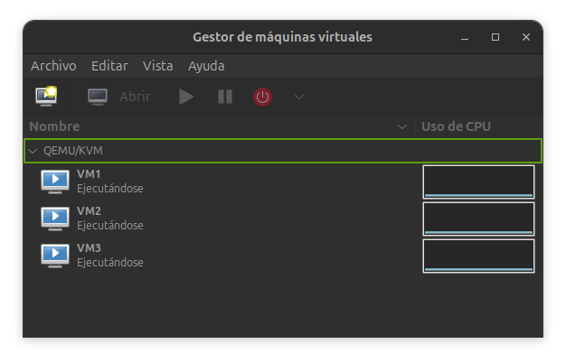
*Virtual Machine Manager mostrando las 3 VMs corriendo, o salida de `virsh list --all`.*

---

## Estructura del repositorio

```
202207999_LAB_SO1_2S2026/
├── Dockerfile
├── go.mod
├── main.go
├── Manual_Tecnico_Proyecto1_SO1_202207999.md
└── README.md
```

---

## Guía de instalación

### Requisitos previos

- 3 VMs con Ubuntu Server 22.04, virtualizadas con KVM
- Acceso SSH a las 3 VMs
- Red interna entre las VMs (verificado con `ping`)

### Instalación de runtimes

**VM1 — Containerd + nerdctl:**
```bash
sudo apt update && sudo apt upgrade -y
sudo apt install -y containerd
sudo systemctl enable --now containerd

CTD_VERSION="2.0.5"
wget https://github.com/containerd/nerdctl/releases/download/v${CTD_VERSION}/nerdctl-full-${CTD_VERSION}-linux-amd64.tar.gz
sudo tar Cxzvvf /usr/local nerdctl-full-${CTD_VERSION}-linux-amd64.tar.gz
sudo systemctl enable --now buildkit
```

**VM2 — Podman:**
```bash
sudo apt update && sudo apt upgrade -y
sudo apt install -y podman
sudo tee -a /etc/containers/registries.conf > /dev/null << 'EOF'

unqualified-search-registries = ["docker.io"]
EOF
```

**VM3 — Docker:**
```bash
sudo apt update && sudo apt upgrade -y
sudo apt install -y ca-certificates curl gnupg
sudo install -m 0755 -d /etc/apt/keyrings
curl -fsSL https://download.docker.com/linux/ubuntu/gpg | sudo gpg --dearmor -o /etc/apt/keyrings/docker.gpg
sudo chmod a+r /etc/apt/keyrings/docker.gpg
echo "deb [arch=$(dpkg --print-architecture) signed-by=/etc/apt/keyrings/docker.gpg] https://download.docker.com/linux/ubuntu $(. /etc/os-release && echo "$VERSION_CODENAME") stable" | sudo tee /etc/apt/sources.list.d/docker.list > /dev/null
sudo apt update
sudo apt install -y docker-ce docker-ce-cli containerd.io docker-buildx-plugin docker-compose-plugin
sudo usermod -aG docker $USER
```

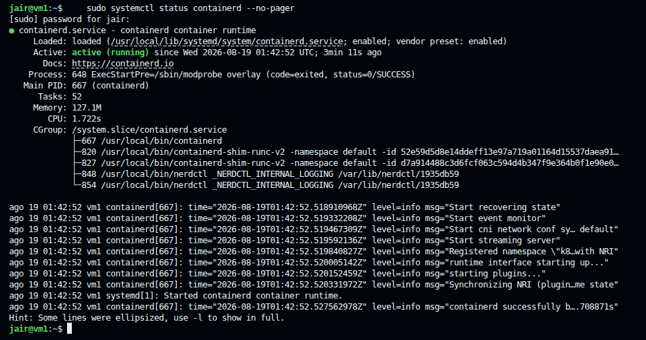
*`sudo systemctl status containerd` en VM1.*

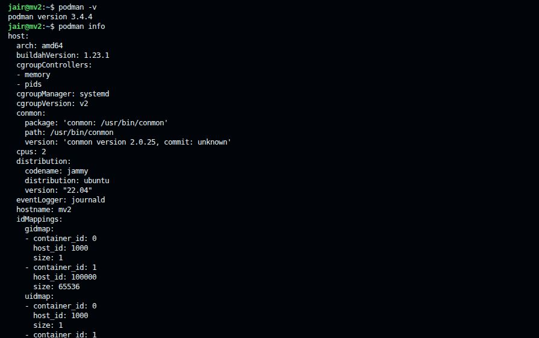
*`podman -v` y `podman info` en VM2.*

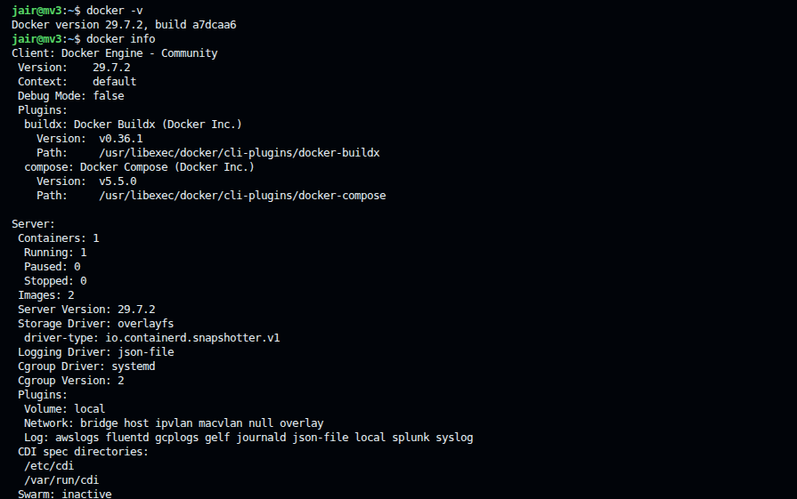
*`docker -v` y `docker info` en VM3. Se verificó además que Docker NO está instalado en VM1 ni VM2.*

### Desplegar Zot (registro privado) en VM3

```bash
mkdir -p ~/zot/config ~/zot/data
cat > ~/zot/config/config.json << 'EOF'
{
  "distSpecVersion": "1.1.0",
  "storage": { "rootDirectory": "/var/lib/registry" },
  "http": { "address": "0.0.0.0", "port": "5000" },
  "log": { "level": "info" }
}
EOF

docker run -d --name zot \
  -p 5000:5000 \
  -v ~/zot/data:/var/lib/registry \
  -v ~/zot/config/config.json:/etc/zot/config.json \
  ghcr.io/project-zot/zot-linux-amd64:latest

docker update --restart unless-stopped zot
```

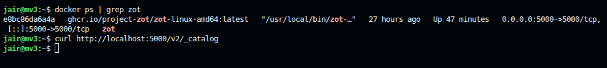
*`docker ps` mostrando Zot en estado `Up`, y `curl http://localhost:5000/v2/` respondiendo `200 OK`.*

### Habilitar registro inseguro (HTTP) en los clientes

**VM1:**
```bash
sudo mkdir -p /etc/containerd/certs.d/192.168.122.202:5000
sudo tee /etc/containerd/certs.d/192.168.122.202:5000/hosts.toml << 'EOF'
server = "http://192.168.122.202:5000"

[host."http://192.168.122.202:5000"]
  capabilities = ["pull", "resolve", "push"]
EOF
sudo systemctl restart containerd
```

**VM2:** agregar a `/etc/containers/registries.conf`:
```toml
[[registry]]
location = "192.168.122.202:5000"
insecure = true
```

### Copiar el código fuente a VM1 y VM2

```bash
scp main.go go.mod Dockerfile jair@192.168.122.220:~/api-service/
scp main.go go.mod Dockerfile jair@192.168.122.156:~/api-service/
```

### Construir y desplegar las APIs

**VM1 (containerd/nerdctl) — API1 y API2:**
```bash
cd ~/api-service
sudo nerdctl build -t api-202207999:latest .
sudo nerdctl tag api-202207999:latest api1-202207999:latest
sudo nerdctl tag api-202207999:latest api2-202207999:latest

sudo nerdctl run -d --name api1 --restart unless-stopped -p 8081:8081 \
  -e APINAME=API1 -e APINUM=1 -e VM=VM1 -e CARNET=202207999 -e PORT=8081 \
  -e PEERS="API2=VM1|http://192.168.122.220:8082,API3=VM2|http://192.168.122.156:8083" \
  api1-202207999:latest

sudo nerdctl run -d --name api2 --restart unless-stopped -p 8082:8082 \
  -e APINAME=API2 -e APINUM=2 -e VM=VM1 -e CARNET=202207999 -e PORT=8082 \
  -e PEERS="API1=VM1|http://192.168.122.220:8081,API3=VM2|http://192.168.122.156:8083" \
  api2-202207999:latest
```

**VM2 (Podman) — API3:**
```bash
cd ~/api-service
podman build -t api3-202207999:latest .

podman run -d --name api3 --restart unless-stopped -p 8083:8083 \
  -e APINAME=API3 -e APINUM=3 -e VM=VM2 -e CARNET=202207999 -e PORT=8083 \
  -e PEERS="API1=VM1|http://192.168.122.220:8081,API2=VM1|http://192.168.122.220:8082" \
  localhost/api3-202207999:latest
```

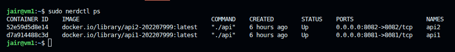
*`sudo nerdctl ps` en VM1.*

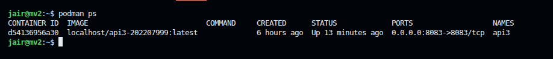
*`podman ps` en VM2.*

### Persistencia tras reinicio

```bash
# VM1 — respaldo con cron
sudo crontab -e
# agregar: @reboot sleep 20 && /usr/local/bin/nerdctl start api1 api2

# VM2 — linger + cron de usuario
sudo loginctl enable-linger jair
crontab -e
# agregar: @reboot sleep 20 && podman start api3
```

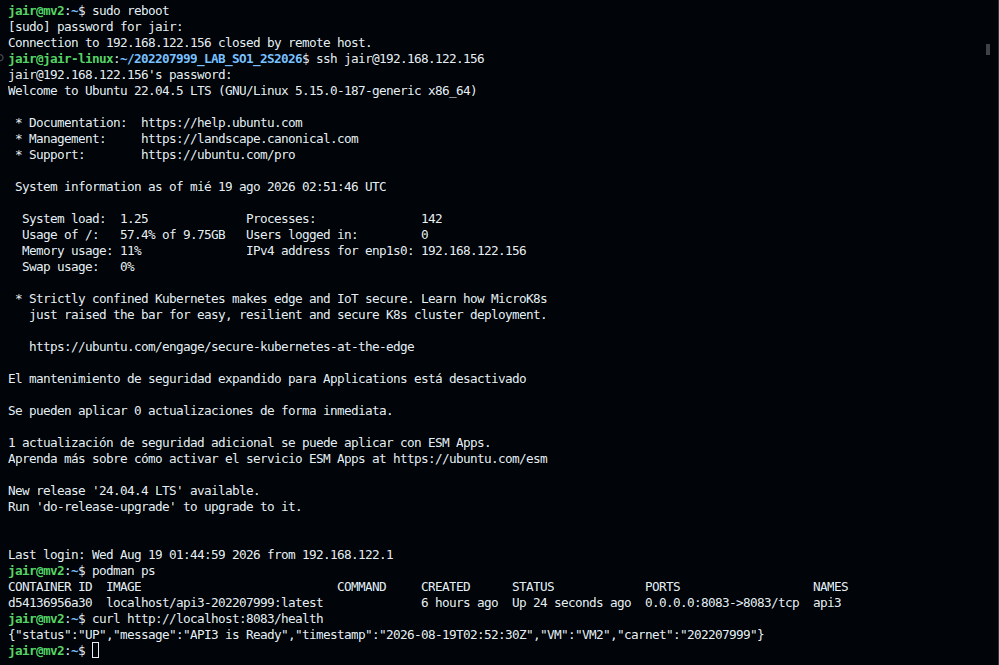
*Tras `sudo reboot` en VM2, el contenedor `api3` vuelve a estar `Up` sin intervención manual, y `/health` responde de inmediato.*

---

## Evidencia funcional

### Health checks

```bash
curl -s http://192.168.122.220:8081/health | jq .
curl -s http://192.168.122.220:8082/health | jq .
curl -s http://192.168.122.156:8083/health | jq .
```

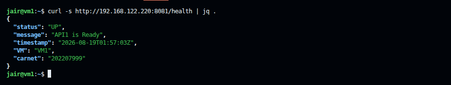

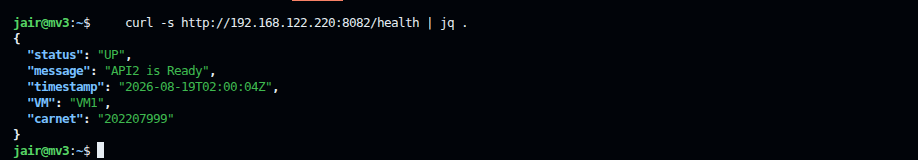

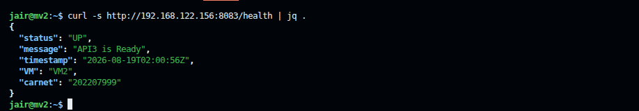

### Imágenes con el formato requerido `[API#-#CARNET]`

```bash
sudo ctr -n default images ls    # VM1
podman images                     # VM2
```

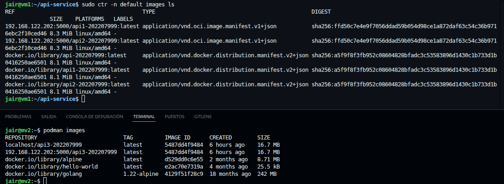

### Registro privado (Zot)

```bash
curl http://192.168.122.202:5000/v2/_catalog
```
```json
{"repositories":["api1-202207999","api2-202207999","api3-202207999"]}
```

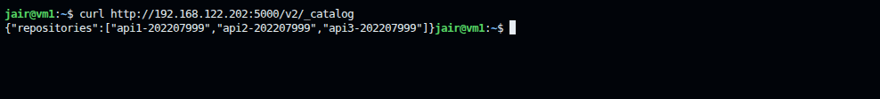

### Push al registro

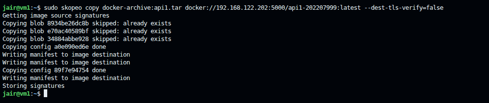
*Salida de `skopeo copy ... docker://192.168.122.202:5000/...` mostrando `Writing manifest to image destination` / `Storing signatures`.*

### Pull desde el registro

```bash
sudo skopeo copy \
  docker://192.168.122.202:5000/api1-202207999:latest \
  docker-archive:/tmp/api1-pull-test.tar \
  --src-tls-verify=false

sudo nerdctl load -i /tmp/api1-pull-test.tar
sudo nerdctl images | grep api1
```

Resultado confirmado: archivo de 16 MB descargado y cargado exitosamente, visible en `nerdctl images`.

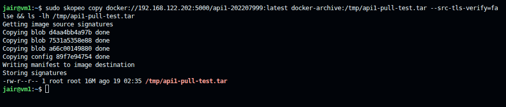

### Comunicación cruzada entre APIs (los 6 endpoints requeridos)

```bash
curl http://192.168.122.220:8081/api1/202207999/call-api2
curl http://192.168.122.220:8081/api1/202207999/call-api3
curl http://192.168.122.220:8082/api2/202207999/call-api1
curl http://192.168.122.220:8082/api2/202207999/call-api3
curl http://192.168.122.156:8083/api3/202207999/call-api1
curl http://192.168.122.156:8083/api3/202207999/call-api2
```

Todas devuelven `"connection":true` con el mensaje `"The API# located on the VM# is working"`.

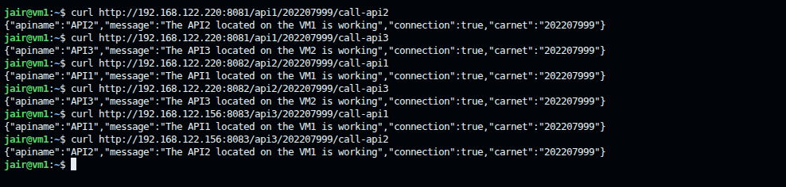

### Manejo de errores (peer caído)

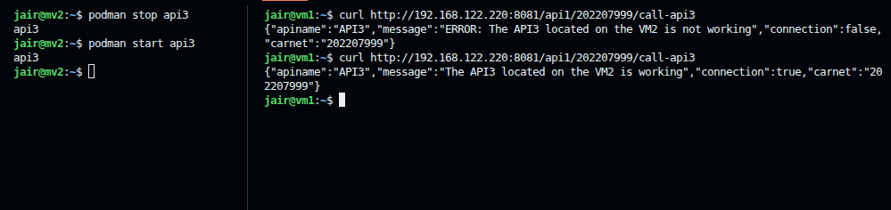
*Ejemplo de respuesta con `"connection":false` y mensaje `"ERROR: The API# located on the VM# is not working"`, generado deteniendo temporalmente un contenedor y volviendo a levantarlo después.*

---

## Documentación adicional

- **[Manual_Tecnico_Proyecto1_SO1_202207999.md](./Manual_Tecnico_Proyecto1_SO1_202207999.md)** — arquitectura completa, decisiones de diseño, y el registro detallado de los incidentes encontrados durante el desarrollo y cómo se resolvieron (Zot sin persistencia, contenedores que no sobrevivían reinicios, formato de mensaje de error).

---

*Universidad de San Carlos de Guatemala — Facultad de Ingeniería — Sistemas Operativos 1*